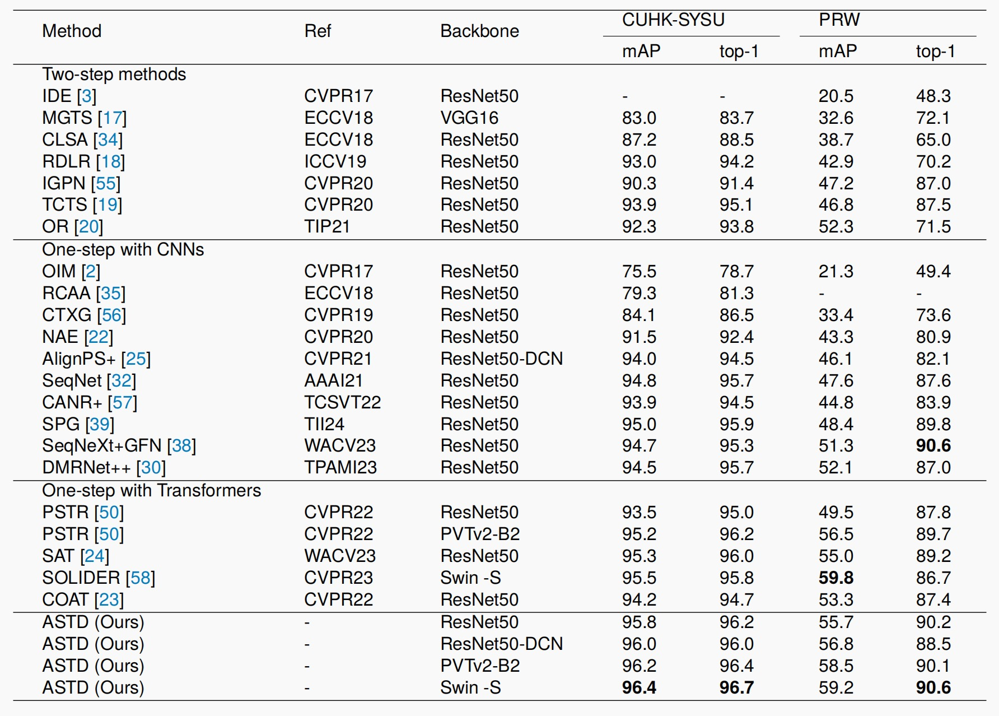
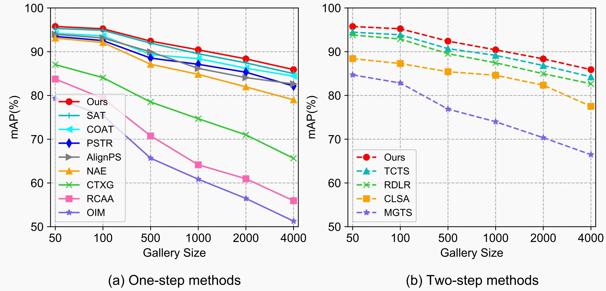

## ↳ Stargazers
[](https://github.com/zqx951102/ASTD/stargazers)
## ↳ Forkers
[](https://github.com/zqx951102/ASTD/network/members)


[](https://opensource.org/licenses/MIT)

<div align="center">

</div>

This repository hosts the source code of our paper: [ASTD](https://github.com/zqx951102/ASTD). 


major challenges:
<div align="center">

</div>


The network structure:

<div align="center">

</div>


****
## :fire: NEWS :fire:
- [07/2024] **📣We released the code.**


## Installation

Run `pip install -r requirements.txt` in the root directory of the project.


## Quick Start

Let's say `$ROOT` is the root directory.

1. Download [CUHK-SYSU](https://drive.google.com/open?id=1z3LsFrJTUeEX3-XjSEJMOBrslxD2T5af) and [PRW](https://drive.google.com/file/d/1Pz81MP8ePlNZMLm_P-AIkUERyOAXWOTV/view?usp=sharing) datasets, and unzip them to `$ROOT/data`

```
data
├── CUHK-SYSU
├── PRW
exp_cuhk
├── config.yaml
├── epoch_xx.pth
├── epoch_xx.pth
exp_prw
├── config.yaml
├── epoch_xx.pth 
├── epoch_xx.pth
```

2. Following the link in the above table, download our pretrained model to anywhere you like, e.g., `$ROOT/exp_cuhk`
3. Run an inference demo by specifing the paths of checkpoint and corresponding configuration file.  You can checkout the result in `demo_imgs` directory.

```
CUDA_VISIBLE_DEVICES=0 python demo.py --cfg exp_cuhk/config.yaml --ckpt exp_cuhk/epoch_12-95.24-95.9.pth    #CUHK
CUDA_VISIBLE_DEVICES=0 python demo.py --cfg exp_prw/config.yaml --ckpt exp_prw/epoch_11-52.39-88.19.pth     #PRW
```


## Training

Pick one configuration file you like in `$ROOT/configs`, and run with it.

```
python train.py --cfg configs/cuhk_sysu.yaml
```

**Note**: At present, our script only supports single GPU training, but distributed training will be also supported in future. By default, the batch size and the learning rate during training are set to 3 and 0.003 respectively, which requires about 28GB of GPU memory. If your GPU cannot provide the required memory, try smaller batch size and learning rate (*performance may degrade*). Specifically, your setting should follow the [*Linear Scaling Rule*](https://arxiv.org/abs/1706.02677): When the minibatch size is multiplied by k, multiply the learning rate by k. For example:

```
CUHK:
CUDA_VISIBLE_DEVICES=0 python train.py --cfg configs/cuhk_sysu.yaml INPUT.BATCH_SIZE_TRAIN 3 SOLVER.BASE_LR 0.003
if out of memory, run this：
CUDA_VISIBLE_DEVICES=0 python train.py --cfg configs/cuhk_sysu.yaml INPUT.BATCH_SIZE_TRAIN 2 SOLVER.BASE_LR 0.0012
PRW:
CUDA_VISIBLE_DEVICES=0 python train.py --cfg configs/prw.yaml INPUT.BATCH_SIZE_TRAIN 3 SOLVER.BASE_LR 0.003
```

**Tip**: If the training process stops unexpectedly, you can resume from the specified checkpoint.

```
python train.py --cfg configs/cuhk_sysu.yaml --resume --ckpt /path/to/your/checkpoint
```

## Test

Suppose the output directory is `$ROOT/exp_cuhk`. Test the trained model:

```
python train.py --cfg $ROOT/exp_cuhk/config.yaml --eval --ckpt $ROOT/exp_cuhk/epoch_19.pth
```

Test with Context Bipartite Graph Matching algorithm:

```
python train.py --cfg $ROOT/exp_cuhk/config.yaml --eval --ckpt $ROOT/exp_cuhk/epoch_19.pth EVAL_USE_CBGM True
```

Test the upper bound of the person search performance by using GT boxes:

```
python train.py --cfg $ROOT/exp_cuhk/config.yaml --eval --ckpt $ROOT/exp_cuhk/epoch_19.pth EVAL_USE_GT True
```
```
Computational complexity:       404.27 GMac
Number of parameters:           50.88 M
AMPN  CUHK:
CUDA_VISIBLE_DEVICES=0 python train.py --cfg exp_cuhk/config.yaml --eval --ckpt exp_cuhk/epoch_12-95.24-95.9.pth
CUDA_VISIBLE_DEVICES=0 python train.py --cfg exp_cuhk/config.yaml --eval --ckpt exp_cuhk/epoch_12-95.24-95.9.pth EVAL_USE_GT True      #use GT 95.9-96.3
AMPN  PRW:
CUDA_VISIBLE_DEVICES=0 python train.py --cfg exp_prw/config.yaml --eval --ckpt exp_prw/epoch_11-52.39-88.19.pth
CUDA_VISIBLE_DEVICES=0 python train.py --cfg exp_prw/config.yaml --eval --ckpt exp_prw/epoch_11-52.39-88.19.pth EVAL_USE_GT True       #use GT 53.9-90.0

Computational complexity:       610.18 GMac
Number of parameters:           54.99 M
AMPN+  CUHK:
CUDA_VISIBLE_DEVICES=0 python train.py --cfg exp_cuhk/config.yaml --eval --ckpt exp_cuhk/epoch_20-95.78-96.07.pth
CUDA_VISIBLE_DEVICES=0 python train.py --cfg exp_cuhk/config.yaml --eval --ckpt exp_cuhk/epoch_20-95.78-96.07.pth EVAL_USE_GT True     #use GT 96.3-96.6
AMPN+  PRW:
CUDA_VISIBLE_DEVICES=0 python train.py --cfg exp_prw/config.yaml --eval --ckpt exp_prw/epoch_13-53.58-88.14.pth
CUDA_VISIBLE_DEVICES=0 python train.py --cfg exp_prw/config.yaml --eval --ckpt exp_prw/epoch_13-53.58-88.14.pth EVAL_USE_GT True       #use GT 55.0-89.5
```


## Comparison with SOTA:


## Evaluation of different gallery size:


Remember that when you test other code, you still need to set it to 100！！

## Visualization of ASA:


## Qualitative Results:


## Acknowledgment
Thanks to the authors of the following repos for their code, which was integral in this project:
- [COAT](https://github.com/Kitware/COAT)
- [SeqNet](https://github.com/serend1p1ty/SeqNet)
- [NAE](https://github.com/dichen-cd/NAE4PS)
- [GFN](https://github.com/LukeJaffe/GFN)
- [PSTR](https://github.com/JialeCao001/PSTR)
- [GLCNet](https://github.com/ZhengPeng7/GLCNet)
- [torchvision](https://github.com/pytorch/vision)

## Pull Request

Pull request is welcomed! Before submitting a PR, **DO NOT** forget to run `./dev/linter.sh` that provides syntax checking and code style optimation.


## Citation
If you find this code useful for your research, please cite our paper
```
@inproceedings{zqx2024,
  title={xxxx},
  author={Zhang, Qixian and Miao, Duoqian},
  booktitle={xxxxxx},
  volume={xx},
  number={x},
  pages={xxx--xxx},
```
```
@inproceedings{li2021sequential,
  title={Sequential End-to-end Network for Efficient Person Search},
  author={Li, Zhengjia and Miao, Duoqian},
  booktitle={Proceedings of the AAAI Conference on Artificial Intelligence},
  volume={35},
  number={3},
  pages={2011--2019},
  year={2021}
}
```

## Contact
If you have any question, please feel free to contact us. E-mail: [zhangqx@tongji.edu.cn](mailto:zhangqx@tongji.edu.cn) 
